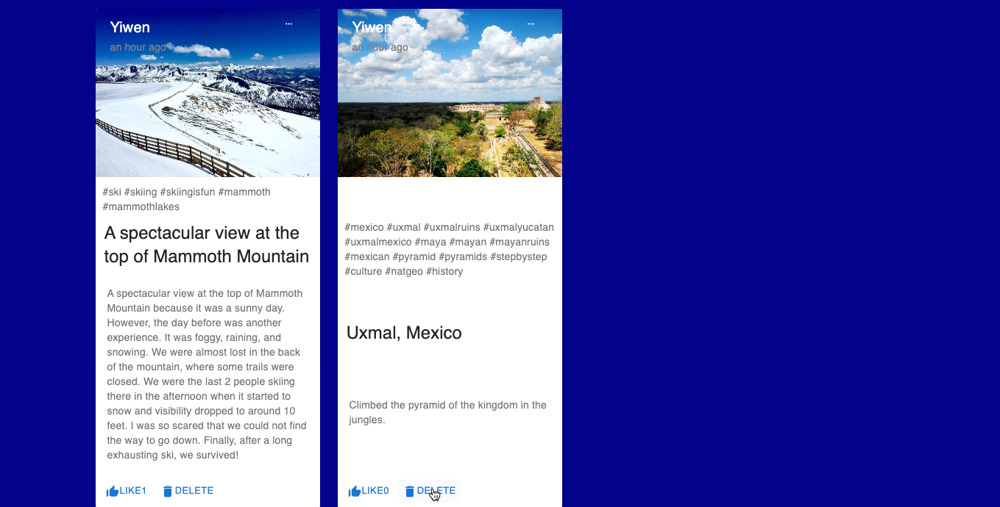

# MERN Photo Gallery: Fullstack CRUD Operations with Image Upload

This is a full-stack web application built using the MERN stack (MongoDB, Express.js, React.js, Node.js). The application provides a platform for users to manage and showcase their photos in a gallery format. It allows users to perform CRUD operations on data entries, along with the ability to upload photos associated with each entry.

The backend communicates with the MongoDB database to store and retrieve photos and data. On the frontend, React.js is utilized to create an interactive user interface for uploading photos and managing photos.

## Table of Contents

- [Features](#features)
- [Technology Stack](#technology-stack)
- [Usage](#usage)
- [Contributing](#contributing)
- [License](#license)

## Features

- **Photo Management & CRUD Operations**: Users can perform CRUD (Create, Read, Update, Delete) operations on their photo collection, including uploading new photos, viewing existing photos, updating photo details, and deleting unwanted photos.
- **Photo Upload**: Supports file upload functionality, allowing users to easily upload photos from their devices to add to their gallery.
- **Redux State Management**: Utilizes Redux for efficient state management, providing a predictable and centralized store for managing application state.
- **MERN Stack**: Utilizes MongoDB for database management, Express.js for backend API development, React.js for frontend user interface, and Node.js for server-side logic.
- **Responsive Design**: The application is designed to be responsive, ensuring a seamless experience across various devices.
- **Interactive Gallery**: The gallery interface provides an interactive and immersive experience for users to browse through their photo collections, view photo details, and perform actions such as editing and deleting photos.
- **Error Handling and Validation**: Incorporates error handling and validation mechanisms to ensure data integrity and provide a smooth user experience, with informative error messages and input validation.

## Technology Stack

### Frontend

- **React.js**: A JavaScript library for building user interfaces.
- **Redux**: A predictable state container for JavaScript apps, used for managing application state.
- **Material-UI**: A popular React UI framework for creating stylish and responsive UI components.
- **Axios**: A promise-based HTTP client for making API requests.

### Backend

- **Node.js**: A JavaScript runtime environment that executes JavaScript code outside a web browser.
- **Express.js**: A web application framework for Node.js, providing a robust set of features for building web applications and APIs.
- **MongoDB**: A NoSQL database used for storing photo data.
- **Mongoose**: An object data modeling (ODM) library for MongoDB and Node.js, providing a straightforward way to work with MongoDB.

## Usage

1. **Installation**:

   - Clone the repository: `git clone https://github.com/yivvm/Project-Fullstack-MERN-CRUD-upload-photos.git`
   - Navigate to the project directory: `cd Project-Fullstack-MERN-CRUD-upload-photos`
   - Install dependencies: `npm install`

2. **Running the Application**:

   - Start the development server: `npm start`
   - Open your browser and visit [http://localhost:5173](http://localhost:5173) to view the application.

3. **Uploading Photos**:

   - Navigate to the upload photo section of the application.
   - Select the photo(s) you want to upload from your device.
   - Input the information of the photo you want to upload.
   - Click the upload button to add the photo(s) to your gallery.

4. **Set up environment variables**:

   - Create a .env file in the root directory and configure environment variables such as MongoDB connection URI, JWT secret, etc.

5. **Managing Photos**:
   - Use the CRUD operations provided in the application to manage your photo collection:
     - Create: Add new photos to your gallery.
     - Read: View and browse through your photo collection.
     - Update: Edit the details or replace existing photos.
     - Delete: Remove unwanted photos from your gallery.
     - Like: Like the photos.

## Deployment

- **Frontend**:
- **Backend**:
